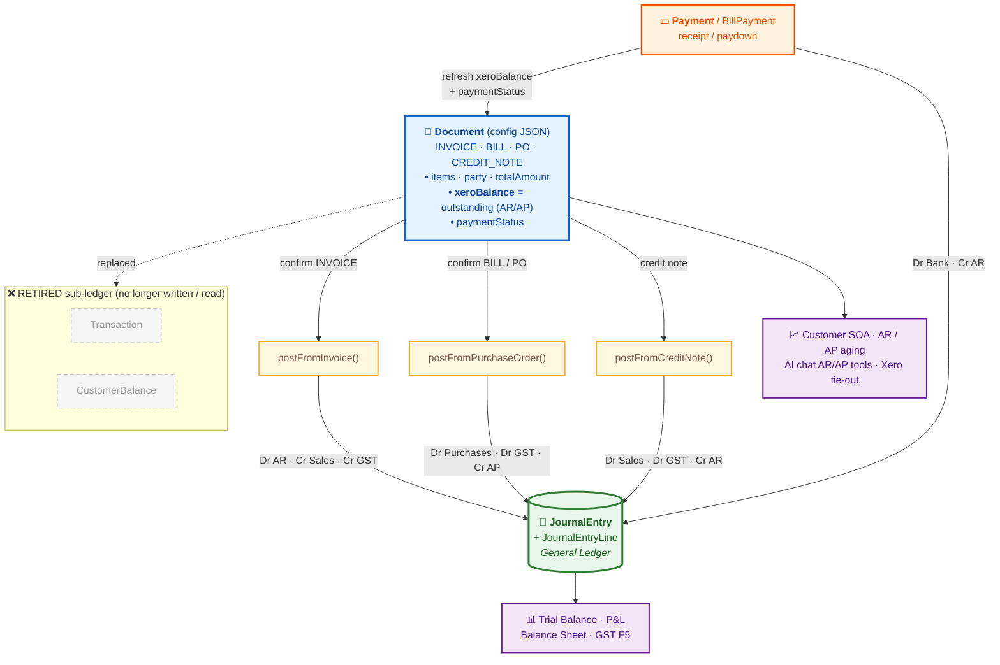

# AIMS Accounting Architecture (post Transaction/CustomerBalance retirement)

_Last updated: 2026-07-03. Describes how a confirmed document flows into every
accounting table, after retiring the `Transaction` / `CustomerBalance`
sub-ledger._

> **Viewing the diagram:** open this file in **GitHub** or **VS Code Markdown
> Preview** (`Cmd+Shift+V`) — the Mermaid map below renders as a real flowchart.

---

## Flow map — document → tables



**Read it as:** a `Document` is the single source of truth. Confirming it posts
to the **GL** (green). A `Payment` posts to the GL **and** writes the outstanding
balance back onto the `Document`. Reports read the **GL**; SOA/aging/AI read the
**Document**. The old `Transaction`/`CustomerBalance` boxes are gone.

---

## 1. The tables (what stores what)

| Table | Role | Written by |
|---|---|---|
| **`ChartOfAccount`** | The accounts (code, name, type, category, normal balance). | Setup / seed / Xero sync |
| **`AccountingSetting.controlAccounts`** (JSON) | Role → account-code map: `debtorControl` (AR), `creditorControl` (AP), `salesAccount`, `taxLiabilities` (GST), `bankAccount`, `cashAccount`, `cogsAccount`, `inventoryAccount`. | Accounting Setup page |
| **`Document`** (`config` JSON) | **THE source of truth for every document** (INVOICE, BILL, PO, CREDIT_NOTE, QUOTATION…). Carries party, line items, totals, and — for AR/AP — the **outstanding balance** (`config.xeroBalance`) + `paymentStatus`. | Document create/confirm, imports |
| **`JournalEntry` + `JournalEntryLine`** | The **General Ledger** (double-entry). What Trial Balance / P&L / Balance Sheet / GST reports read. | `journal-auto-post.service` on confirm |
| **`Payment`** | Customer receipts (AR). Each links `documentId` (the invoice) + `customerId`. | `payments.service` |
| **`BillPayment`** | Supplier payments (AP). Links a BILL + `supplierId`. | `bills.service` |
| **`Customer` / `Supplier`** | Contacts. `xeroId` ties each to a Xero contact. | Imports / CRUD |

### RETIRED (no longer read or written by app logic)
| Table | Was | Now |
|---|---|---|
| **`Transaction`** | Per-customer AR ledger with a pre-computed running `balance`. | ❌ Not written on confirm/payment. Not read by SOA/aging. AR is derived from `Document` instead. |
| **`CustomerBalance`** | Cached per-customer balance. | ❌ Not written/read. Balance = sum of `Document.config.xeroBalance`. |

> The two tables still exist in the schema (kept for safety/rollback) but are
> dead. The `transactions/` NestJS module is unwired from `app.module`. They can
> be dropped in a later migration once confirmed unneeded.

**Why retired:** AR used to live in 3 places (Document, Transaction, GL) that
drifted — the Xero AR sync updated Document + GL but not Transaction, so the SOA
(which read Transaction) went stale. Now there is **one AR source: the invoice
`Document`**, which the SOA, aging, AI tools, and Xero tie-out all read.

---

## 2. Flow: confirming a **Sales Invoice**

```
User confirms INVOICE (documents.service.confirmInvoice)
        │
        ├─► Document.status = confirmed                         [Document table]
        │     config carries: items, customer, totalAmount,
        │     xeroBalance (= outstanding), paymentStatus
        │
        └─► journalAutoPost.postFromInvoice()                   [JournalEntry + lines]
              Dr  Accounts Receivable (debtorControl)   gross
                Cr  Sales (salesAccount)                net
                Cr  GST Payable (taxLiabilities)        tax
```
No Transaction row is written. **AR = Σ `Document.config.xeroBalance`** across
unpaid invoices.

## 3. Flow: recording a **Customer Payment**

```
payments.service.create()
        │
        ├─► Payment row created                                [Payment table]
        ├─► postFromPayment()                                   [JournalEntry + lines]
        │     Dr  Bank / Cash (bankAccount/cashAccount)  amount
        │       Cr  Accounts Receivable (debtorControl)  amount
        │
        └─► updateInvoiceStatusAfterPayment()                   [Document table]
              recomputes totalPaid from all Payment rows, then sets
              Document.config.xeroBalance = total − paid
              Document.status = paid | pending_payment
```
So a payment updates **Payment + GL + the invoice Document's balance** — the SOA
and AR immediately reflect it (they read the Document).

## 4. Flow: **Bill / Purchase Order** (AP)

```
Confirm BILL / PO
        └─► postFromPurchaseOrder()                             [JournalEntry + lines]
              Dr  Purchases (net)
              Dr  GST Receivable (taxLiabilities)  tax
                Cr  Trade Payables (creditorControl)  gross
```
AP outstanding = Σ `Document(BILL).config.xeroBalance`. Supplier payments →
`BillPayment` + `postFromPayment`-style GL entry. AP never used the Transaction
table.

## 5. Flow: **Credit Note**

```
postFromCreditNote()                                            [JournalEntry + lines]
  Dr  Sales (net)
  Dr  GST Payable (taxLiabilities)  tax
    Cr  Accounts Receivable (debtorControl)  gross
```
For Xero-imported data, a credit note's effect is already folded into the
related invoice's `xeroBalance`, so the SOA doesn't double-count it.

---

## 6. Who READS AR/AP now (all one source: `Document`)

| Consumer | Reads |
|---|---|
| **Customer SOA** (`statements.generateSOA`) | `Document`(INVOICE + CREDIT_NOTE) + `Payment` → chronological running balance |
| **AR aging** (`statements.calculateAging` / `getAgingSummary`) | unpaid `Document`(INVOICE) `xeroBalance` bucketed by due date |
| **Supplier SOA / AP aging** | `Document`(BILL) + `BillPayment` |
| **AI chat AR/AP tools** (`ask.service`) | `Document`(INVOICE/BILL) `xeroBalance` |
| **Reports** (TB / P&L / Balance Sheet / GST) | `JournalEntry` / `JournalEntryLine` |

**Reconciliation guarantee:** AR from `Document` (Σ `xeroBalance`) ties to the GL
AR-control (`debtorControl`) and to Xero. Verified 2026-07-03: China Railway SOA
= **$72,739.28**, matching Xero exactly; org-wide AR ≈ **$10.99M** = Xero.

---

## 7. Data model at a glance

```
                 ┌──────────────────────────────────────────┐
                 │              Document (config JSON)         │  ← ONE source of
                 │  INVOICE / BILL / PO / CREDIT_NOTE / ...    │    truth per doc
                 │  • items, party, totalAmount               │
                 │  • xeroBalance  ← outstanding (AR/AP)       │
                 │  • paymentStatus                           │
                 └───────┬───────────────────────┬────────────┘
        confirm →        │                       │        ← payment refreshes
                         ▼                       ▼           xeroBalance
              ┌────────────────────┐   ┌────────────────────┐
              │   JournalEntry     │   │  Payment /         │
              │   + JournalLine    │   │  BillPayment       │
              │   (the GL)         │   │  (receipts/paydowns)│
              └─────────┬──────────┘   └────────────────────┘
                        │
       reads ───────────┼─────────────────────────────────────
        • TB / P&L / BS / GST   → JournalEntry
        • SOA / aging / AI AR   → Document (+ Payment/BillPayment)

        RETIRED:  Transaction ✗   CustomerBalance ✗
```

---

## 8. Known follow-ups (not done here)
1. **GST stays as ONE shared account** (`taxLiabilities`, netting output + input) — this
   matches Xero, which also uses a single GST account. A split into separate
   GST Payable / GST Receivable accounts was considered and **deliberately not
   adopted** (it would diverge from Xero's balance sheet). The F5 output/input
   breakdown is produced from transaction detail, not separate GL accounts.
2. **Drop `Transaction` + `CustomerBalance` tables** from the schema once the dead
   `transactions/` module is deleted and no rollback is needed.
3. **Per-line revenue/expense accounts** on post (currently a single sales/purchase
   account — see memory `auto-post-double-entry-issues`).
